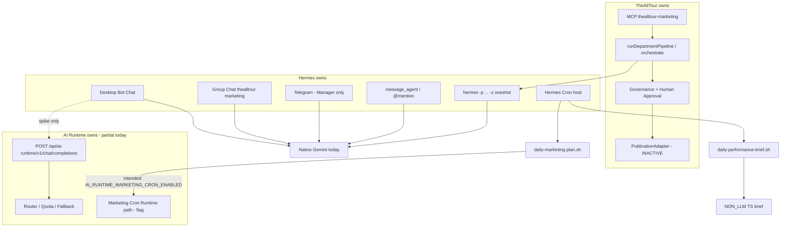
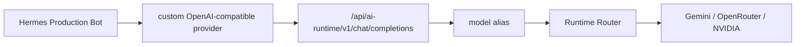

# Production Bot Runtime Gateway Cutover Audit — STEP 2-5.4C5

> **READ-ONLY AUDIT + CUTOVER PLAN.** This STEP does **not** change Production Bot profiles, groups, routines, credentials, Runtime routing behavior, or `PUBLICATION_FLOW_INACTIVE`.  
> Agent Handoff Runtime migration remains **DEFERRED**. Hermes source patch/fork is **forbidden**.

**Audit date:** 2026-08-28  
**Source of truth (in priority order):**

1. Installed Hermes Agent **v0.20.5** (`pyproject.toml`; git `03537d69` under `~/.hermes/hermes-agent`)
2. Live profile homes `~/.hermes/profiles/<id>/` and group store `~/.hermes/profile.yaml`
3. thealltour repo (`src/ai-runtime/**`, `src/lib/marketing/**`) as of `59527ac`
4. Prior C-series docs: C0 native audit, C1 inference boundary, C2 tool protocol, C3 structured output, C4 Desktop E2E, C4.1 live fallback

**Legend:** **CONFIRMED** = read from live install/config/code. **INFERRED** = derived from those facts with explicit reasoning. **UNKNOWN** = not observed; not guessed.

---

## C6 update (2026-08-28) — Gateway hardening complete

**C6 verdict: IMPLEMENTATION GO for C7 canary prep** (code + docs only; Production profiles still unchanged).

| C5 blocker | C6 resolution |
|---|---|
| `agentId` hardcoded `runtime-spike` | **Removed.** Alias registry maps production aliases → real `agentId`. |
| Production identity attribution | `thealltour/<profile-id>` aliases + `X-AI-Runtime-Agent-Id` header. |
| `spikeForceFallback` blast radius | Registry-gated; only `theallcloud/auto-fallback-spike`. Env flag no longer affects production or `theallcloud/auto`. |
| Workload mapping | Per-alias: `analysis`, `content_draft`, `governance`, `manager_decision`. |
| Dual fallback risk | `validateHermesRuntimeCutoverConfig()` documents `fallback_providers: []` invariant. |
| Unknown alias abuse | Allowlist → `INVALID_REQUEST`. |

**Reference:** [runtime-inference-gateway.md](./runtime-inference-gateway.md)  
**Next:** **STEP 2-5.4C7** — Performance Analyst profile canary (first Production `config.yaml` edit).

### C6.1 deploy verification (2026-08-28)

**Verdict: COMPLETE / PRODUCTION GATEWAY READY**

| Gate | Result |
|---|---|
| `npm run build` | PASS (`BUILD_ID=2fujBtd9wGTE-vPNAUG6j`) |
| HTTP alias smoke 4/4 | PASS — correct `agentId` / workload headers |
| Auth (401/403/bearer) | PASS |
| Negative (unknown alias, spike isolation, C4.1 spike fallback) | PASS |
| Shared observability | PASS — production agents only, no spike mis-attribution |
| Regression (gateway + router + C1–C4.1 related) | 59/59 PASS |
| Hermes Production profiles | **UNCHANGED** (still native Gemini) |
| `thealltour-internal.service` | **RESTORED** — PID 25907, `active (running)`, `:3000` listener under systemd |

**Final restore check (2026-08-28 ~15:03 KST):** manual `next-server` terminated; post-smoke HTTP alias smoke 4/4 PASS; unauthenticated → 401; service remains active.

### C6.2 Marketing Manager 09:00 cron path repair (2026-08-28)

**Verdict: COMPLETE / CRON PATH REPAIRED**

| Item | Detail |
|---|---|
| Root cause | `daily-marketing-plan.sh` had `cd /home/ysh/theallcloud`; repo moved to `/home/ysh/thealltour`; `cron-daily-marketing-plan.ts` exists only under thealltour |
| Repair | `cd /home/ysh/thealltour` (matches 08:30 Analyst wrapper convention) |
| File changed | `~/.hermes/profiles/marketing-manager/scripts/daily-marketing-plan.sh` line 15 only |
| Manual one-shot | **PASS** — exit 0, `inference_path: ai-runtime`, no `ERR_MODULE_NOT_FOUND`, no `/home/ysh/theallcloud` reference |
| Runtime workloads | `content-strategist` / `content_draft`, `governance-auditor` / `governance`; correlationId `marketing-cron:…:cb7fd192`; fallback=false; gemini-main |
| Publication safety | `PUBLICATION_FLOW_INACTIVE=true`; `sns_side_effect: 0`; `publishActionIncluded: false`; governance ALLOW → publish_ready (no publish) |
| Scheduled `jobs.json` | **Unchanged** by manual run — `last_status: error` (2026-08-28 09:00 failure) until next scheduled 09:00 |
| 08:30 Analyst | **Unchanged** — `9e96a94ee72f`, `30 8 * * *`, `no_agent: true`, NON_LLM, wrapper still `cd /home/ysh/thealltour`, `last_status: ok` |
| C7 impact | None — Hermes Production Bot inference configs unchanged |

---

## 1. Executive Summary

**C5 overall verdict: PLAN READY / IMPLEMENTATION NO-GO until Gateway identity is production-capable.**

C1–C4.1 proved that a **non-production** Hermes profile (`runtime-spike`) can use a custom OpenAI-compatible `base_url` against `/api/ai-runtime/v1`, keep Hermes MCP/tool loop ownership, and exercise Runtime provider fallback. That path is **not** yet safe to copy onto the four Production Bots.

| Question | Answer |
|---|---|
| Can Hermes v0.20.5 point a Bot at Runtime without a fork? | **Yes (CONFIRMED).** Spike profile already does: `model.provider: custom` + `base_url` + `api_mode: chat_completions` + `fallback_providers: []`. |
| Are Production Bots on that path today? | **No (CONFIRMED).** All four: `provider: gemini`, `default: gemini-3.5-flash-lite`, `base_url: ''`, `fallback_providers: [openrouter, openai]`. |
| Would a profile-level cutover stay inside Desktop Chat? | **No (CONFIRMED).** The same profile model config is used by Bot Chat, Group Chat, Telegram (Manager), `message_agent` turns, and `hermes -p … -z` oneshot. It does **not** migrate Handoff to a Runtime *direct call* — it still goes through Hermes CLI — but oneshot inference would start hitting the Gateway. |
| Blocker for first canary? | **Yes.** Gateway `mapOpenAiCompatToRuntimeRequest` hardcodes `agentId: "runtime-spike"` and `priority: "high"`. Production traffic would be mis-tagged as spike (observability + `spikeForceFallback` blast radius). |
| SNS auto-publish risk if cutover proceeds later? | **None from publication adapters (CONFIRMED).** `PUBLICATION_FLOW_INACTIVE = true` compile-time in `governanceBoundary.ts`. |

**Recommended next implementation STEP:** **2-5.4C6 — Production-ready Gateway identity / alias / workload mapping** (code only; still no Production profile edits). Then **2-5.4C7 — Performance Analyst canary** (single profile config + backup).

---

## 2. Production Bot Inventory

Four Production marketing Bots exist as Hermes profiles. Names match the expected kebab-case ids. A fifth profile `runtime-spike` is **not** Production. `test1` is **not** Production.

Hermes version compatibility: all four share `_config_version: 39` and run under the multiplex gateway / Desktop remote `100.79.96.45:9119` (CONFIRMED in group membership). Installed agent **v0.20.5**.

Credential values are **not** recorded. Sources observed by **env var name only**:

| Env var | Typical use |
|---|---|
| `GOOGLE_API_KEY` | Gemini primary (Hermes native provider) |
| `OPENROUTER_API_KEY` | Hermes `fallback_providers` |
| `OPENAI_API_KEY` | Hermes `fallback_providers` |
| `MARKETING_BOT_INTERNAL_TOKEN` | MCP `Authorization: Bearer ${…}` |
| `MCP_THEALLTOUR_MARKETING_API_KEY` | MCP server side (same class of secret) |
| `TELEGRAM_BOT_TOKEN` / `TELEGRAM_ALLOWED_USERS` / `TELEGRAM_HOME_CHANNEL` | Manager Telegram only |
| `AI_RUNTIME_INFERENCE_GATEWAY_TOKEN` | Spike custom provider → Gateway bearer (Production profiles do **not** reference this today) |
| `NVIDIA_API_KEY` | Home `~/.hermes/.env` / Runtime NVIDIA adapter — **not** Production Bot `model.provider` |

### 2.1 marketing-manager

| Field | Value | Evidence |
|---|---|---|
| Profile name | `marketing-manager` | `~/.hermes/profiles/marketing-manager/` |
| Title | Marketing Manager | `profile.yaml` `ui_meta.hermes-bots.title` |
| Config path | `~/.hermes/profiles/marketing-manager/config.yaml` | — |
| Provider / model | `gemini` / `gemini-3.5-flash-lite` | `config.yaml` `model` |
| `base_url` | empty | CONFIRMED |
| `api_mode` | unset (native Gemini path) | CONFIRMED |
| `fallback_providers` | `openrouter`, `openai` | CONFIRMED |
| `fallback_model` | commented / unused | CONFIRMED |
| Streaming (inference) | `streaming.enabled: false` | CONFIRMED. `display.streaming: true` is UI only. |
| Telegram | **enabled: true** | Only Production Bot with Telegram on |
| Memory | `memory_enabled: true` | `MEMORY.md` present |
| Canonical Bot Chat pin | **Missing** `ui_meta.hermes-bots.chat` | CONFIRMED vs specialists. Desktop Bot Chat may still exist; **pin id UNKNOWN**. |
| MCP | `thealltour-marketing` enabled | Tools: `get_marketing_context`, `search_marketing_memory`, `build_content_brief`, `evaluate_governance`, `prepare_marketing_task`, `review_generated_content`, `get_performance_evidence`, `run_department_orchestration` |
| Skills | Bundled Hermes skills + `SOUL.md` role contract | CONFIRMED `skills/.bundled_manifest` |
| Routines/cron | One job, `--no-agent` | See §3 |
| Group | `thealltour marketing` | `profile.yaml` + `~/.hermes/profile.yaml` rooms |
| `message_agent` / `@mention` | **Possible and used in Group** | Group log shows Manager speaking and mentioning specialists (CONFIRMED). Tool availability in canonical Bot Chat is official v0.20.5 Bot Mode behavior (INFERRED from guide + `bot_mode_dm.py`; not re-probed this STEP). |

**Runtime-sensitive behavior (Manager):**

| Need | Verdict | Basis |
|---|---|---|
| Plain chat | **Yes** | Desktop / Telegram / Group |
| Tool calling | **Yes** | MCP include list + Group MCP prompts |
| Multiple sequential tool calls | **Yes** | Group log: `search_marketing_memory` then `get_marketing_context` in the same thread |
| Structured output | **UNKNOWN** | Main Bot path does not send `response_format` (C3). No live Manager `response_format` capture this STEP. |
| Tools + structured output | **UNKNOWN** | C3: main Bot loop does not normally combine them |
| Large context | **UNKNOWN** | Compression enabled; actual token sizes not measured |
| Streaming | **No (config)** | `streaming.enabled: false` |
| Provider-specific | **INFERRED likely** | Native Gemini today; C4 showed thoughtSignature matters once tools round-trip via Runtime Gemini adapter |

### 2.2 content-strategist

| Field | Value |
|---|---|
| Config | `~/.hermes/profiles/content-strategist/config.yaml` |
| Inference | Same as Manager: Gemini `gemini-3.5-flash-lite`, empty `base_url`, fallback `openrouter`+`openai` |
| Telegram | `enabled: false` |
| Canonical Bot Chat | `ui_meta.hermes-bots.chat: 20260825_133449_8b118f` **CONFIRMED** |
| Memory | enabled; no `MEMORY.md` file found (settings on, file absent) |
| MCP include | `get_marketing_context`, `search_marketing_memory`, `build_content_brief`, `evaluate_governance` |
| Cron | **None** (`jobs.json` absent) |
| Group | member of `thealltour marketing` |
| Structured output | **UNKNOWN** for Desktop; department/oneshot prompts may ask for draft shape (prompt-level, not `response_format`) |

Tool calling: **Yes**. Sequential tools: **Yes** (Group log). Streaming: **No (config)**.

### 2.3 governance-auditor

| Field | Value |
|---|---|
| Config | `~/.hermes/profiles/governance-auditor/config.yaml` |
| Inference | Same Gemini pin + Hermes fallbacks |
| Telegram | `enabled: false` |
| Canonical Bot Chat | `20260825_133439_def619` **CONFIRMED** |
| MCP include | `get_marketing_context`, `search_marketing_memory`, `evaluate_governance`, `review_generated_content` |
| Cron | **None** |
| Group | member |

Independent ALLOW/REVIEW/BLOCK inspector (SOUL / `profile.yaml` description). Does **not** publish. Tool calling **Yes**. Structured output **UNKNOWN** (governance MCP is deterministic TheAllTour; LLM review may return JSON-ish text — not proven as `response_format`).

### 2.4 performance-analyst

| Field | Value |
|---|---|
| Config | `~/.hermes/profiles/performance-analyst/config.yaml` |
| Inference | Same Gemini pin + Hermes fallbacks |
| Telegram | `enabled: false` |
| Canonical Bot Chat | `20260825_133423_f2c9b2` **CONFIRMED** |
| MCP include | `get_marketing_context`, `search_marketing_memory`, `get_performance_evidence` |
| Cron | One `--no-agent` job (NON_LLM body) |
| Group | member |

Group log shows a JSON-looking metrics reply (**CONFIRMED** text). That is **not** proof of OpenAI `response_format` (UNKNOWN). Tool calling **Yes**.

### 2.5 Non-production reference: `runtime-spike`

Already on the target inference shape (CONFIRMED `config.yaml`):

- `model.provider: custom`
- `default: theallcloud/auto`
- `base_url: http://127.0.0.1:3000/api/ai-runtime/v1`
- `api_mode: chat_completions`
- `fallback_providers: []`
- extra alias `theallcloud/auto-fallback-spike` in `providers.*.models`
- MCP spike server `thealltour-marketing-spike` (`get_performance_evidence` only)
- `agent.bot_mode_protocol: false`

This profile is the **cutover template**, not a Production Bot.

---

## 3. Invocation Topology



### 3.1 Path inventory (all four Bots)

| Path | Used today? | Hits Production profile LLM? | Notes |
|---|---|---|---|
| 1. Desktop canonical Bot Chat | **Yes** (specialists pinned). Manager pin **UNKNOWN** | Yes | Native Gemini |
| 2. Group Chat | **Yes** | Yes (each speaker’s profile) | Room `thealltour marketing`; 4 members; `@mention` observed |
| 3. `@mention` | **Yes** in Group | Yes | Group log 2026-08-26 |
| 4. `message_agent` | **Possible**; live tool dump **UNKNOWN** this STEP | Yes if used | Official Bot Chat-only tool |
| 5. Hermes Routine/Cron | Manager 09:00, Analyst 08:30 | **No** (`no_agent: true`) | Script bodies; see below |
| 6. Shell/script | Cron wrappers | Indirect | Manager wrapper `cd /home/ysh/theallcloud` |
| 7. TheAllTour application | MCP + pipeline | Oneshot specialists | Not Gateway |
| 8. Legacy `hermes -p … -z` | **Yes** | **Yes** | `hermesHandoff.ts` / `hermesRuntime.ts` / tests |
| 9. Runtime direct invocation | Cron flag path + spike Gateway | Spike / cron specialists **not** via Bot Chat | Interactive Production Bots: **not** on Gateway |

### 3.2 Marketing Manager 09:00 cron — do not confuse with Bot cutover

| Field | CONFIRMED |
|---|---|
| Job | `AI Marketing - Daily Plan` (`edfc1815135b`) |
| Schedule | `0 9 * * *` Asia/Seoul implied by timestamps |
| `no_agent` | **true** |
| Script | `daily-marketing-plan.sh` |
| Intended Runtime path | `AI_RUNTIME_MARKETING_CRON_ENABLED` defaults to **`true`** in the wrapper |
| Observability flag | `AI_RUNTIME_SHARED_OBSERVABILITY_ENABLED` defaults **`true`** |
| Last run | 2026-08-28 09:00:32 **`last_status: error`** (pre-C6.2; path fixed 2026-08-28 ~15:13 KST) |
| Last error | `ERR_MODULE_NOT_FOUND` `/home/ysh/theallcloud/scripts/cron-daily-marketing-plan.ts` (historical) |
| Next run | 2026-08-29 09:00 |

**C6.2 repair (2026-08-28):** wrapper `cd` corrected to **thealltour**. Manual one-shot PASS (`inference_path: ai-runtime`). Scheduled `last_status` updates only on Hermes cron fire — not faked by manual run.

Interactive Bot cutover is **orthogonal**: even when 09:00 works, it is `--no-agent` + either Hermes oneshot **or** `RuntimeExecutor` inside TS — not Desktop Gateway.

### 3.3 Performance Analyst 08:30 cron

| Field | CONFIRMED |
|---|---|
| Job | `AI Marketing - Daily Performance` (`9e96a94ee72f`) |
| Schedule | `30 8 * * *` |
| `no_agent` | **true** |
| Script | `daily-performance-brief.sh` → `thealltour/scripts/cron-daily-performance-brief.ts` |
| LLM | **None** (NON_LLM) |
| Last run | 2026-08-28 08:30:17 **`last_status: ok`** |
| Next run | 2026-08-29 08:30 |

Canarying this Bot’s **inference** config does **not** change the 08:30 job body.

### 3.4 Agent Handoff / oneshot (DEFERRED migration)

Still `invokeHermesOneshot` → `hermes -p <profile> --yolo --ignore-rules -z`.  
**CONFIRMED** `HERMES_HANDOFF_CLASSIFICATION` remains application-level.  
**C5 must not** replace this with Runtime `executeAndWait`.

**Cutover coupling (INFERRED, important):** if a specialist profile’s `model.*` is pointed at the Gateway, **oneshot will also call the Gateway**, because `-z` uses that profile’s provider config. That is still Hermes-owned invocation, not a Runtime-direct Handoff rewrite.

---

## 4. Bot-by-Bot Runtime Compatibility Matrix

Scoring vs C1–C4.1 **spike** evidence. Production Bots themselves were **not** pointed at the Gateway in this STEP.

Scale: **PASS** · **PARTIAL** · **UNTESTED** · **BLOCKED** · **N/A**

Shared Gateway facts (CONFIRMED):

- Runtime does **not** execute MCP tools (C2).
- Hermes keeps tool loop / memory / Bot Chat.
- Spike: Hermes `fallback_providers: []` + Runtime `allowFallback: true` (C4.1).
- Production today: Hermes fallbacks **enabled** → dual-fallback **BLOCKED** until cleared per Bot.

| Capability | Manager | Content | Governance | Analyst | Spike evidence | Production gap |
|---|---|---|---|---|---|---|
| Plain inference | UNTESTED | UNTESTED | UNTESTED | UNTESTED | C1/C4 PASS | Profile still native Gemini |
| Context continuity | UNTESTED | UNTESTED | UNTESTED | UNTESTED | C4 PASS on spike Bot Chat | Hermes memory stays Hermes; Gateway does not store Bot memory (**PASS as design**) |
| Tool protocol | PARTIAL | PARTIAL | PARTIAL | PARTIAL | C2 PASS (wire) | Production MCP sets larger than spike |
| Actual MCP execution | UNTESTED | UNTESTED | UNTESTED | UNTESTED | C4 PASS `get_performance_evidence` | Manager `run_department_orchestration` **UNTESTED** on Gateway |
| Structured output | UNTESTED | UNTESTED | UNTESTED | UNTESTED | C3 gateway mapping PASS; Desktop Bot Chat **NOT_EXERCISED** | Aux `response_format` UNTESTED on Production |
| Streaming | N/A | N/A | N/A | N/A | C1 emulated SSE | Production `streaming.enabled: false` |
| Runtime provider fallback | UNTESTED | UNTESTED | UNTESTED | UNTESTED | C4.1 PASS (spike alias) | Requires `fallback_providers: []` + Gateway identity not spike-only |
| Observability | BLOCKED | BLOCKED | BLOCKED | BLOCKED | Headers + optional Postgres sink | `agentId` hardcoded `runtime-spike` |
| Security | PARTIAL | PARTIAL | PARTIAL | PARTIAL | Bearer 401 + private-net 403 | Token must be in canary `key_env`; not in Production yaml today |
| Rollback | PASS (design) | PASS | PASS | PASS | Restore profile `model` + `fallback_providers` | Not exercised on Production (by design) |

**Manager-specific:** `run_department_orchestration` during a Gateway-backed turn still runs inside Hermes MCP → TheAllTour TS → oneshot. That nested oneshot uses **target** profile inference. Canarying Manager without specialists still fans out to native Gemini specialists (INFERRED). Canarying specialists first is safer for isolating Gateway blast radius.

---

## 5. Failure / Risk Matrix

`PUBLICATION_FLOW_INACTIVE = true` **CONFIRMED** (`src/lib/marketing/social/publication/governanceBoundary.ts`). SNS adapter callers are denied. Cutover of inference **cannot** by itself enable SNS publish.

| Bot | Risk | Why |
|---|---|---|
| performance-analyst | **MEDIUM** | No Telegram; smallest MCP set; 08:30 cron NON_LLM. Still a Group member — Group turns for this handle would use Gateway after canary. Oneshot if department `performance` intent fires. |
| content-strategist | **MEDIUM** | Draft quality / fact invention risk; Group + oneshot from department/cron-if-Hermes-path. No Telegram. |
| governance-auditor | **HIGH** | Independent inspection; wrong routing/model could weaken ALLOW/REVIEW/BLOCK. Group + oneshot. |
| marketing-manager | **CRITICAL** | Telegram front door; Group orchestrator; full MCP including department orchestration; user-visible. 09:00 is `--no-agent` so cron host ≠ Bot LLM, but interactive failure is still high. |

Rollback difficulty: **LOW** if only `config.yaml` `model` / `fallback_providers` / `providers` stanzas change (copy/restore). **HIGH** if Gateway identity remains spike-hardcoded (bad metrics, hard to distinguish canary). History/memory/group membership are **not** in those stanzas.

Other Bots depending on a canary: Group `@mention` / `message_agent` **yes**. Cron 08:30 **no**. Cron 09:00 **no** for profile LLM (`no_agent`); specialist oneshot only if that job’s TS Hermes path runs (currently not reaching TS).

---

## 6. Recommended Canary Order

The prior hypothesis (Analyst → Strategist → Auditor → Manager) is **kept**, but **re-justified** from live inventory. It is **not** “low risk because Group is unused” — Group **is** used.

| Order | Bot | Canary suitability | Prerequisites | Blast radius | Observation window | Success criteria | Rollback trigger |
|---|---|---|---|---|---|---|---|
| 1 | performance-analyst | **Best** | C6 Gateway identity; profile backup; Next `:3000` up; `fallback_providers: []`; token via `key_env`; spikeForceFallback **off** | This Bot Chat + this handle’s Group/mention turns + performance oneshot | **24h** including one 08:30 cron (cron must stay ok / NON_LLM) | Plain + MCP `get_performance_evidence` Desktop; headers show real `agentId`; Fallback header coherent; no dual Hermes fallback | 5xx/401 Gateway; empty replies; Group analyst mute; oneshot timeouts |
| 2 | content-strategist | After Analyst green | Same + content alias → `content_draft` | Draft oneshot + Group content turns | **24–48h** | Draft still fact-bound; MCP brief tools; no publish | Hallucinated offers; tool-loop stall |
| 3 | governance-auditor | After content | Governance alias → `governance` | Review oneshot + Group | **24h** | ALLOW/REVIEW/BLOCK still via MCP `evaluate_governance` where used; LLM review coherent | Systematic ALLOW without evidence |
| 4 | marketing-manager | Last | All specialists stable **or** explicitly accepted mixed mode; Telegram probe window | Telegram + Group lead + department MCP | **48h** including one business day of Telegram | Orchestration MCP still TheAllTour; no SNS; Telegram session distinct from Bot Chat ([desktop-deployment.md](./desktop-deployment.md)) | Telegram silence; department fan-out failure |

**Do not canary Manager first.** Telegram + Group lead + largest tool set.

**Do not canary all four at once.** Profile-level switch is the isolation unit.

---

## 7. Cutover Mechanism (design only)

### 7.1 Target topology



Hermes profile keeps: identity, sessions, memory, MCP client, skills, cron **host**.  
Runtime keeps: eligibility, quota, provider/model fallback, usage.

### 7.2 What to put on Hermes vs Runtime

**Hermes (minimal per canary Bot):**

```yaml
model:
  provider: custom
  default: theallcloud/performance   # example Analyst alias
  base_url: http://127.0.0.1:3000/api/ai-runtime/v1
  api_mode: chat_completions
fallback_providers: []
providers:
  theallcloud-runtime:
    base_url: http://127.0.0.1:3000/api/ai-runtime/v1
    api_mode: chat_completions
    key_env: AI_RUNTIME_INFERENCE_GATEWAY_TOKEN
```

Do **not** paste gateway tokens into Production `config.yaml` (spike currently has an inline `api_key` — **do not copy that pattern**).

**Runtime (policy):**

| Concern | Recommendation |
|---|---|
| Shared vs Bot alias | **Bot-specific aliases.** A single `theallcloud/auto` maps to `manager_decision` today — wrong default for content (`content_draft`) and governance (`governance`). |
| `agentId` | **Must** become the Hermes profile id (`performance-analyst`, …), not `runtime-spike`. Prefer alias allowlist; optional later header if Hermes sends one **without a fork** (UNKNOWN if a supported header exists — do not patch Hermes). |
| `workloadClass` | From alias (existing `resolveWorkloadForAlias`) once Production aliases are added. |
| `requiresToolCalling` | **Yes — from `tools[]` presence** (already CONFIRMED in mapper). |
| Structured output | **Yes — from `response_format`** (already CONFIRMED). |
| `priority` | Today Gateway forces `high`. **GAP:** interactive vs cron-oneshot undistinguished. Cron 09:00 Runtime path uses its own factory (separate). For Bot Gateway, default `high` is acceptable for Desktop; oneshot-on-Gateway may need `normal` later (**not this STEP**). |
| Dual fallback | Hermes `fallback_providers` **must be `[]`** on canary. Runtime `allowFallback: true`. |

### 7.3 New operational dependency

Today Production Bots infer even if Next.js is down (native Gemini). After cutover, **Next `:3000` Gateway availability becomes a hard dependency** for that Bot’s LLM. Document SLO / Hermes service vs `next start` coupling before C7.

---

## 8. Feature Flag / Rollback Strategy

**Chosen mechanism:** Hermes-native **per-profile `config.yaml` backup/restore** of the `model` / `fallback_providers` / `providers` keys only.

| Option | Verdict |
|---|---|
| Profile config backup/restore | **Primary.** Minutes; no credential rotation; no memory/group loss |
| Model/provider alias switch | Same files; keep a commented native Gemini block or `*.c5bak` |
| Runtime-side routing flag | **Secondary.** Useful to refuse unknown aliases; cannot restore native Gemini by itself |
| Hermes source flag | **Forbidden** |

**Bot-only canary:** edit one profile home. Multiplex gateway reads per-profile config. Other Bots stay on Gemini.

**Rollback (target RTO minutes):**

1. Copy `config.yaml.c5bak` → `config.yaml` (native Gemini + original fallbacks).
2. Do **not** restart Desktop group membership.
3. Confirm next turn does not hit Gateway (no `X-AI-Runtime-*` / Hermes uses `provider: gemini`).
4. Leave Runtime code in place.

Spike already has `config.yaml.c4bak` as a precedent.

Runtime-side kill switch (optional later): reject non-spike aliases until C6 ships — **not implemented in C5**.

---

## 9. Security / Observability

### 9.1 CONFIRMED present

| Control | Status |
|---|---|
| Gateway bearer `AI_RUNTIME_INFERENCE_GATEWAY_TOKEN` | 401 mismatch / 503 if unset |
| Non-private `X-Forwarded-For` | 403 `forbidden_network`; empty header **allows** (rely on bind + bearer) |
| Safe response headers | Request-Id, Alias, Provider, Model, Fallback, Attempt-Count, Tool-Defs, Tool-Calls |
| Prompt/tool payload not in those headers | C1/C4 design |
| Shared Postgres telemetry | Flag `AI_RUNTIME_SHARED_OBSERVABILITY_ENABLED`; scalars only (see [runtime-observability.md](./runtime-observability.md)) |
| Publication blocked | `PUBLICATION_FLOW_INACTIVE` |
| MCP tools have no publish | skill matrix forbidden actions |

### 9.2 GAPs (record only — do not implement in C5)

| GAP | Impact |
|---|---|
| Gateway `agentId` hardcoded `runtime-spike` | Production canary would pollute spike metrics; `spikeForceFallback` keyed on that id |
| No profile identity on the wire from Hermes without alias convention | Need Production alias allowlist |
| `priority` always `high` | Cannot tell Desktop vs oneshot |
| `isPrivateClientAddress` allow-on-missing-header | Defense in depth weaker than bind-localhost |
| Spike `config.yaml` inline `api_key` | Bad template for Production |
| Manager Bot Chat pin missing | Harder to prove canonical session for Telegram vs Desktop |
| 09:00 cron `theallcloud` cwd | **REPAIRED (C6.2).** Manual one-shot PASS; next scheduled 09:00 confirms `last_status` |
| Latency / token usage in **HTTP headers** | In DB events when shared sink on; not all in Gateway headers |
| Error class in headers | Retryable header on failure path only |

---

## 10. Known Gaps

1. **BLOCKER — Gateway identity** (`agentId` / correlation prefix always spike).
2. **BLOCKER — dual Hermes+Runtime fallback** if Production `fallback_providers` left enabled.
3. **BLOCKER — workload alias** if all Bots send `theallcloud/auto`.
4. **Production MCP surface > spike** (`run_department_orchestration` untested through Gateway).
5. **Agent Handoff oneshot coupling** if specialists cut over (still Hermes `-z`, not Runtime-direct).
6. **Next.js process dependency** after cutover.
7. **09:00 cron entrypoint path** — **RESOLVED (C6.2)**; was theallcloud vs thealltour ops GAP
8. **Manager `chat` pin absent.**
9. **Structured output on Production Desktop** still UNTESTED (C3/C4).
10. **Streaming** N/A for this fleet (`enabled: false`).
11. Handoff → Runtime **direct** still **DEFERRED**.
12. MCP server ACL still prompt-level (pre-existing).

---

## 11. Go / No-Go Criteria

### 11.1 This STEP (C5)

| Criterion | Result |
|---|---|
| Production profiles unchanged | **GO** (audit only) |
| Groups / cron / credentials / `PUBLICATION_FLOW_INACTIVE` unchanged | **GO** |
| Documented inventory + plan | **GO** |
| Start Production canary now | **NO-GO** |

### 11.2 Before first Production canary (C7)

Must all be true:

1. Gateway maps `agentId` from a Production alias allowlist (not hardcoded spike).
2. `spikeForceFallback` cannot fire for Production aliases / ids.
3. Per-Bot aliases encode workload (`performance` / `content` / `governance` / `manager`).
4. Canary `fallback_providers: []`.
5. Gateway token via `key_env`, not committed yaml.
6. `config.yaml` backup file on disk.
7. Next.js Gateway health check documented and green.
8. Desktop Analyst MCP probe plan ready.
9. 08:30 cron still `--no-agent` / last_status observed.
10. Rollback owner assigned; RTO minutes.

---

## 12. Exact recommended next implementation step

**STEP 2-5.4C6 — Production-ready inference Gateway mapping (code, no Production profile edits)**

Implement in `src/ai-runtime/gateway` + tests:

1. Stop hardcoding `agentId: "runtime-spike"` for all requests.
2. Allowlist Production aliases (e.g. `theallcloud/performance`, `theallcloud/content`, `theallcloud/governance`, `theallcloud/manager`) plus existing spike aliases.
3. Derive `agentId` + `workload` from alias; keep spikeForceFallback **spike-only**.
4. Keep Hermes MCP/tool loop ownership; do not call Runtime from Handoff.
5. Tests only; no `~/.hermes/profiles/performance-analyst/config.yaml` writes.

**Then STEP 2-5.4C7:** Performance Analyst canary using the mechanism in §7–8.

---

## Appendix A — Current vs target (summary)

**Current (Production):** Hermes Bot → native Gemini (+ Hermes OpenRouter/OpenAI fallbacks) → MCP to TheAllTour. Runtime Gateway used only by `runtime-spike` (+ optional 09:00 TS Runtime path when that script actually runs).

**Target (per canary Bot):** Hermes Bot → custom base_url → Runtime Router (sole provider fallback) → providers. Hermes still executes tools/MCP/memory/Group/Telegram.

## Appendix B — Files read (no writes outside this document)

- `~/.hermes/profiles/{marketing-manager,content-strategist,governance-auditor,performance-analyst,runtime-spike}/config.yaml`
- matching `profile.yaml`, cron `jobs.json` / scripts
- `~/.hermes/profile.yaml` (group room)
- `src/ai-runtime/gateway/request-mapper.ts`, `auth.ts`, `src/app/api/ai-runtime/v1/chat/completions/route.ts`
- `src/lib/marketing/bot/organization/hermesRuntime.ts`, `hermesHandoff.ts`
- `src/lib/marketing/social/publication/governanceBoundary.ts`
- C0–C4.1 docs listed in the header
