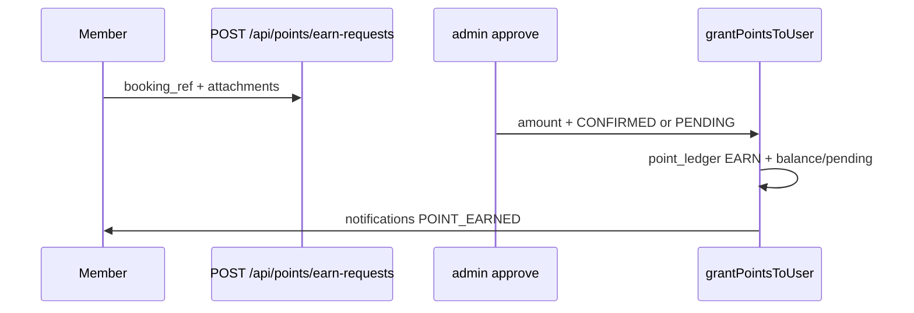

# 회원 리워드 시스템 코드 발췌 1차 — 적립·정책·DB

> **관련 문서**
> - [2차: 교환·관리자·인덱스·부채](./member-rewards-system-code-excerpts-2.md)
> - [API 엔드포인트 요약](../src/app/api/docs/points-rewards-api.md)

---

## 목차

1. [시스템 개요](#1-시스템-개요)
2. [타입 정의 (`pointsRewardsV2.ts`)](#2-타입-정의)
3. [정책 설정 (`rewardPolicy.ts`)](#3-정책-설정)
4. [적립 경로 A — 예약 증빙 요청 (Earn Request)](#4-적립-경로-a--예약-증빙-요청)
5. [적립 경로 B — 관리자 수동 지급](#5-적립-경로-b--관리자-수동-지급)
6. [잔액 조회 (마이페이지 / API)](#6-잔액-조회)
7. [DB 스키마 (마이그레이션)](#7-db-스키마)

---

## 1. 시스템 개요

### v2 데이터 모델

| 구성 | 역할 |
|------|------|
| `members.point_balance` | 사용 가능(확정) 포인트 캐시 |
| `members.point_pending` | 미확정 적립 합계 캐시 |
| `point_ledger` | 모든 포인트 변동의 **원장**(Single Source of Truth) |
| `reward_catalog` | 경품 카탈로그 |
| `reward_redemptions` | 경품 교환 신청·승인·발송 |
| `point_earn_requests` | 예약 증빙 기반 적립 요청 |
| `notifications` | 포인트·경품 상태 알림 |

### 포인트 원장 유형 (`PointLedgerType`)

| type | 코드 사용 여부 | 설명 |
|------|---------------|------|
| `EARN` | ✅ | 적립 (CONFIRMED → balance, PENDING → pending) |
| `USE` | ⚠️ 레거시 | 승인 시 재차감 (v2 RESERVE와 충돌 — [2차 문서](./member-rewards-system-code-excerpts-2.md#7-기술-부채) 참고) |
| `RESERVE` | ✅ | 교환 신청 시 포인트 예약 |
| `RELEASE` | ✅ | 교환 반려 시 예약 해제·잔액 복구 |
| `EXPIRE` | ❌ 타입만 | 소멸 배치 없음 |
| `ADJUST` | ❌ 타입만 | 수동 조정 API 없음 |

### 적립(Earn) 플로우



---

## 2. 타입 정의

==================================================
파일 경로:
`src/types/pointsRewardsV2.ts`
==================================================

[1] 포인트·경품·알림 v2 타입 전체

```ts
/**
 * 포인트·경품·알림 스키마 v2 타입 (앱 목표 스키마 기준 주 사용 타입)
 * - point_ledger: user_id, type, status, amount(양수), ref_type, ref_id
 * - reward_redemptions: user_id, catalog_id, status 대문자, shipping_address1, shipping_zip, admin_memo, decided_at
 * - users 역할 = members (member_id / user_id 동일 대상)
 */

export type MemberPointsExtension = {
  point_balance: number;
  point_pending: number;
  grade_id: string | null;
  marketing_opt_in: boolean;
};

export type PointLedgerType =
  | "EARN"    // 적립
  | "USE"     // 사용(경품 등)
  | "EXPIRE"  // 소멸
  | "ADJUST"  // 조정
  | "RESERVE" // 예약(미확정)
  | "RELEASE"; // 예약 해제/확정

export type PointLedgerStatus = "PENDING" | "CONFIRMED" | "CANCELED";

export type PointLedgerRow = {
  id: string;
  user_id: string;
  type: PointLedgerType;
  status: PointLedgerStatus;
  amount: number; // 항상 양수
  reason: string | null;
  ref_type: string | null;
  ref_id: string | null;
  expires_at: string | null;
  created_at: string;
};

export type RewardCatalogRow = {
  id: string;
  title: string;
  description: string | null;
  point_price: number;
  point_cost: number;
  image_url: string | null;
  stock_count: number;
  stock: number | null; // null = 무제한
  is_active: boolean;
  sort_order: number;
  created_at: string;
  updated_at: string;
};

export type RewardRedemptionStatus =
  | "REQUESTED"
  | "APPROVED"
  | "REJECTED"
  | "SHIPPED"
  | "COMPLETED"
  | "CANCELED";

export type RewardRedemptionRow = { /* ... */ };

export type NotificationType = "REWARD_STATUS" | "POINT_EARNED" | "ADMIN_MESSAGE";

export type RewardRedemptionRequestInput = {
  catalog_id: string;
  user_message?: string;
  shipping_name: string;
  shipping_phone: string;
  shipping_address1: string;
  shipping_address2?: string;
  shipping_zip?: string;
};
```

---

## 3. 정책 설정

==================================================
파일 경로:
`src/config/rewardPolicy.ts`
==================================================

[1] `getRewardPolicy`, `getPointExpiresAt` 전체

```ts
export type RewardPolicyConfig = {
  minRedeemPoint: number;
  monthlyRedeemLimit: number;
  pointExpiryMonths: number;
  rateLimitWindowMinutes: number;
  rateLimitMaxRequests: number;
  rejectLookbackDays: number;
  rejectThreshold: number;
};

export function getRewardPolicy(): RewardPolicyConfig {
  return {
    minRedeemPoint: envInt("REDEEM_MIN_POINTS", 10_000),
    monthlyRedeemLimit: envInt("REDEEM_MONTHLY_LIMIT", 1),
    pointExpiryMonths: envInt("POINT_EXPIRY_MONTHS", 12),
    rateLimitWindowMinutes: envInt("REDEEM_RATE_LIMIT_WINDOW_MINUTES", 60),
    rateLimitMaxRequests: envInt("REDEEM_RATE_LIMIT_MAX_REQUESTS", 3),
    rejectLookbackDays: envInt("REDEEM_REJECT_LOOKBACK_DAYS", 90),
    rejectThreshold: envInt("REDEEM_REJECT_THRESHOLD", 3),
  };
}

/** EARN 생성 시 expires_at = now + pointExpiryMonths 개월. 0 이하면 null(무제한). */
export function getPointExpiresAt(): string | null {
  const policy = getRewardPolicy();
  if (policy.pointExpiryMonths <= 0) return null;
  const d = new Date();
  d.setMonth(d.getMonth() + policy.pointExpiryMonths);
  return d.toISOString();
}
```

### 환경변수 표

| 변수 | 기본값 | 용도 |
|------|--------|------|
| `REDEEM_MIN_POINTS` | 10000 | 1회 교환 최소 포인트 |
| `REDEEM_MONTHLY_LIMIT` | 1 | 월 교환 횟수 제한 |
| `POINT_EXPIRY_MONTHS` | 12 | EARN `expires_at` (월) |
| `REDEEM_RATE_LIMIT_WINDOW_MINUTES` | 60 | 동일 계정 rate limit 윈도우(분), 0=비활성 |
| `REDEEM_RATE_LIMIT_MAX_REQUESTS` | 3 | 윈도우 내 최대 신청 횟수 |
| `REDEEM_REJECT_LOOKBACK_DAYS` | 90 | 반려/취소 누적 기간(일) |
| `REDEEM_REJECT_THRESHOLD` | 3 | 위 기간 내 반려+취소 ≥ N이면 신청 차단 |
| `POINT_EARN_REQUEST_BUCKET` | `product-images` | 증빙 파일 스토리지 버킷 |

---

## 4. 적립 경로 A — 예약 증빙 요청

### 4-1. 증빙 검증·CSV 파싱

==================================================
파일 경로:
`src/server/services/points/earnRequests.ts`
==================================================

[1] 상수·첨부 검증·CSV 파싱

```ts
export const MAX_ACTIVE_EARN_REQUESTS = 1;
export const MAX_EARN_ATTACHMENTS = 3;
export const MIN_EARN_ATTACHMENTS = 1;
export const MAX_ATTACHMENT_SIZE = 10 * 1024 * 1024; // 10MB

export function validateEarnRequestAttachment(file: File) {
  if (!file) return { ok: false as const, message: "첨부 파일이 필요합니다." };
  if (file.size > MAX_ATTACHMENT_SIZE) {
    return { ok: false as const, message: "파일당 최대 10MB까지 업로드할 수 있습니다." };
  }
  if (!(file.type.startsWith("image/") || file.type === "application/pdf")) {
    return { ok: false as const, message: "허용 형식은 이미지 또는 PDF입니다." };
  }
  return { ok: true as const };
}

export function parseSimpleCsvRows(csvText: string) {
  // 헤더: booking_ref, amount, grant_status[, admin_memo]
  // ...
}
```

### 4-2. 회원 POST — 적립 요청 접수

==================================================
파일 경로:
`src/app/api/points/earn-requests/route.ts`
==================================================

[1] POST 핵심 — 중복·활성 요청 검증, DB insert, 첨부 업로드

```ts
export async function POST(request: Request) {
  const auth = await requireMemberSession();
  if (auth.res) return auth.res;
  const userId = auth.session.memberId;

  const formData = await request.formData();
  const bookingRef = String(formData.get("booking_ref") ?? "").trim();
  const departureDate = String(formData.get("departure_date") ?? "").trim();
  const payerName = String(formData.get("payer_name") ?? "").trim();
  const files = formData.getAll("attachments").filter((v): v is File => v instanceof File);

  // 필수·첨부 검증 ...
  // 진행 중 REQUESTED 1건 제한, booking_ref 유니크 검증 ...

  const { data: reqRow } = await supabase
    .from("point_earn_requests")
    .insert({ user_id: userId, status: "REQUESTED", booking_ref: bookingRef, /* ... */ })
    .select("id")
    .maybeSingle();

  // 스토리지 업로드 → earn_request_attachments insert
  // 실패 시 point_earn_requests 롤백(delete)
  // notifications ADMIN_MESSAGE "포인트 적립 요청 접수"

  return NextResponse.json({ id: requestId, message: "적립 요청이 접수되었습니다." }, { status: 201 });
}
```

### 4-3. 관리자 승인 — `grantPointsToUser` 호출

==================================================
파일 경로:
`src/app/api/admin/points/earn-requests/[id]/approve/route.ts`
==================================================

[1] 승인 후 포인트 지급 (실패 시 earn request 상태 롤백)

```ts
export async function POST(request: Request, context: { params: Promise<{ id: string }> }) {
  const auth = await requireAdminSession();
  if (!auth.ok) return auth.res;

  const amount = Number(body.amount);
  const grantStatus = body.grant_status === "PENDING" ? "PENDING" : "CONFIRMED";

  // point_earn_requests status === REQUESTED 확인
  await supabaseAdmin.from("point_earn_requests").update({
    status: "APPROVED", decided_at: now, decided_by_admin_id: "ADMIN",
  }).eq("id", id).eq("status", "REQUESTED");

  try {
    await grantPointsToUser({
      userId: row.user_id,
      amount,
      status: grantStatus,
      reason: `예약 적립 요청 승인 (${row.booking_ref})`,
      refType: "EARN_REQUEST",
      refId: row.id,
      actorAdminId: "ADMIN",
    });
    // EARN_REQUEST_MESSAGE_TEMPLATES 알림
  } catch (error) {
    // earn request → REQUESTED 롤백
  }
}
```

### 4-4. 마이페이지 UI — submit

==================================================
파일 경로:
`src/components/points/EarnRequestForm.tsx`
==================================================

[1] FormData POST `/api/points/earn-requests`

```tsx
const submit = async () => {
  if (!bookingRef || !departureDate || !payerName) { /* ... */ }
  if (files.length < 1 || files.length > 3) { /* ... */ }

  const formData = new FormData();
  formData.append("booking_ref", bookingRef);
  formData.append("departure_date", departureDate);
  formData.append("payer_name", payerName);
  formData.append("contact_phone", contactPhone);
  formData.append("memo", memo);
  files.forEach((file) => formData.append("attachments", file));

  const res = await fetch("/api/points/earn-requests", { method: "POST", body: formData });
  // 성공 시 폼 초기화 + onSubmitted()
};
```

---

## 5. 적립 경로 B — 관리자 수동 지급

### 5-1. 핵심 서비스 — `grantPointsToUser`

==================================================
파일 경로:
`src/server/services/points/grantPoints.ts`
==================================================

[1] 전체 — EARN 원장 + balance/pending 반영 + 알림

```ts
import "server-only";
import { supabaseAdmin } from "@/lib/supabaseAdmin";
import { getPointExpiresAt } from "@/config/rewardPolicy";

export type GrantPointStatus = "CONFIRMED" | "PENDING";

type GrantPointsParams = {
  userId: string;
  amount: number;
  status: GrantPointStatus;
  reason: string;
  refType?: string;
  refId?: string;
  actorAdminId?: string | null;
  expiresAt?: string | null;
};

export async function grantPointsToUser(params: GrantPointsParams) {
  const userId = params.userId.trim();
  const amount = Number(params.amount);
  if (!userId) throw new Error("userId는 필수입니다.");
  if (!Number.isFinite(amount) || amount <= 0) throw new Error("amount는 1 이상의 숫자여야 합니다.");

  const { data: memberRow } = await supabaseAdmin
    .from("members")
    .select("id, point_balance, point_pending")
    .eq("id", userId)
    .maybeSingle();

  const currentBalance = Number(memberRow?.point_balance ?? 0);
  const currentPending = Number(memberRow?.point_pending ?? 0);
  const status = params.status === "PENDING" ? "PENDING" : "CONFIRMED";

  const { data: ledgerRow } = await supabaseAdmin.from("point_ledger").insert({
    user_id: userId,
    type: "EARN",
    status,
    amount,
    reason: params.reason?.trim() || "관리자 지급",
    ref_type: params.refType?.trim() || null,
    ref_id: params.refId?.trim() || null,
    expires_at: params.expiresAt ?? getPointExpiresAt(),
  }).select("id").maybeSingle();

  if (status === "CONFIRMED") {
    await supabaseAdmin.from("members").update({ point_balance: currentBalance + amount }).eq("id", userId);
  } else {
    await supabaseAdmin.from("members").update({ point_pending: currentPending + amount }).eq("id", userId);
  }

  await supabaseAdmin.from("notifications").insert({
    user_id: userId,
    type: "POINT_EARNED",
    title: "포인트 적립",
    body: status === "CONFIRMED"
      ? `${amount}P가 적립되었습니다.`
      : `${amount}P가 적립 예정입니다. (확정 후 사용 가능합니다.)`,
  });

  return { ledgerId: ledgerRow.id, appliedStatus: status, actorAdminId: params.actorAdminId ?? null };
}
```

### 5-2. 관리자 API

==================================================
파일 경로:
`src/app/api/admin/points/grant/route.ts`
==================================================

[1] POST — `grantPointsToUser` 래퍼

```ts
export async function POST(request: Request) {
  const auth = await requireAdminSession();
  if (!auth.ok) return auth.res;

  const { userId, amount, reason, status, refType, refId, expiresAt } = body;
  const result = await grantPointsToUser({
    userId, amount, status: status === "PENDING" ? "PENDING" : "CONFIRMED",
    reason: reason?.trim() || "관리자 지급",
    refType, refId, expiresAt, actorAdminId: "ADMIN",
  });
  return NextResponse.json({ message: "...", ledgerId: result.ledgerId });
}
```

### 5-3. 관리자 UI — 지급 핸들러

==================================================
파일 경로:
`src/components/admin/AdminPointsGrantManager.tsx`
==================================================

[1] `handleGrant` — `/api/admin/points/grant` 호출

```tsx
const handleGrant = useCallback(async () => {
  const res = await fetch("/api/admin/points/grant", {
    method: "POST",
    headers: { "Content-Type": "application/json" },
    body: JSON.stringify({
      userId: selected.id,
      amount: num,
      reason: reason.trim() || "관리자 지급",
      status: grantStatus,
      refType: refType.trim() || undefined,
      refId: refId.trim() || undefined,
      expiresAt: expiresAtIso,
    }),
  });
  // 성공 시 ledger 목록 낙관적 갱신
}, [selected, amount, reason, grantStatus, /* ... */]);
```

### 5-4. PENDING → CONFIRMED 확정 (관리자 API, UI 없음)

==================================================
파일 경로:
`src/app/api/admin/points/confirm/route.ts`
==================================================

[1] ledger PENDING EARN → CONFIRMED, balance↑ pending↓

```ts
/** 관리자: pending EARN을 CONFIRMED로 전환 */
export async function POST(request: Request) {
  // ledger type=EARN, status=PENDING 확인
  await supabaseAdmin.from("point_ledger").update({ status: "CONFIRMED" }).eq("id", ledgerId);
  await supabaseAdmin.from("members").update({
    point_balance: balance + amount,
    point_pending: pending - amount,
  }).eq("id", userId);
}
```

> UI 연동 없음 — [2차 문서 기술 부채](./member-rewards-system-code-excerpts-2.md#7-기술-부채) 참고.

---

## 6. 잔액 조회

### 6-1. 회원 API

==================================================
파일 경로:
`src/app/api/me/points/route.ts`
==================================================

[1] GET — balance, pending, expiringSoon(30일), ledger 50건

```ts
export async function GET() {
  const auth = await requireMemberSession();
  const userId = auth.session.memberId;

  const [memberRes, ledgerRes, expiringRes] = await Promise.all([
    supabase.from("members").select("point_balance, point_pending").eq("id", userId).maybeSingle(),
    supabase.from("point_ledger").select("*").eq("user_id", userId)
      .order("created_at", { ascending: false }).limit(50),
    supabase.from("point_ledger").select("amount").eq("user_id", userId)
      .eq("type", "EARN").eq("status", "CONFIRMED")
      .not("expires_at", "is", null)
      .gte("expires_at", now).lte("expires_at", nowPlus30Days),
  ]);

  return NextResponse.json({ balance, pending, expiringSoon, ledger });
}
```

### 6-2. 마이페이지 SSR

==================================================
파일 경로:
`src/lib/member/meServerData.ts`
==================================================

[1] `getMemberPointsData` — API self-fetch 대신 supabaseAdmin 직접 조회

```ts
export type MemberPointsData = {
  balance: number;
  pending: number;
  expiringSoon: number;
  ledger: PointLedgerRow[];
};

export async function getMemberPointsData(memberId: string): Promise<MemberPointsData | null> {
  const [memberRes, ledgerRes, expiringRes] = await Promise.all([
    supabaseAdmin.from("members").select("point_balance, point_pending").eq("id", memberId).maybeSingle(),
    supabaseAdmin.from("point_ledger").select("*").eq("user_id", memberId)
      .order("created_at", { ascending: false }).limit(50),
    // expiringSoon: EARN CONFIRMED + expires_at 30일 이내
  ]);
  return { balance, pending, expiringSoon, ledger };
}
```

==================================================
파일 경로:
`src/app/mypage/points/page.tsx`
==================================================

[2] SSR — `getMemberPointsData`로 잔액·내역 렌더, `/mypage/points/request` 링크

---

## 7. DB 스키마

### 7-1. v2 핵심 테이블

==================================================
파일 경로:
`supabase/migrations/20250304000000_points_rewards_v2.sql`
==================================================

[1] members 확장 + point_ledger + reward_catalog + reward_redemptions + notifications

```sql
-- members
alter table public.members add column if not exists point_balance integer not null default 0;
alter table public.members add column if not exists point_pending integer not null default 0;

-- point_ledger (기존 테이블 drop 후 재생성)
create table public.point_ledger (
  id uuid primary key default gen_random_uuid(),
  user_id uuid not null references public.members(id) on delete cascade,
  type text not null check (type in ('EARN','USE','EXPIRE','ADJUST','RESERVE','RELEASE')),
  status text not null default 'CONFIRMED' check (status in ('PENDING','CONFIRMED','CANCELED')),
  amount integer not null check (amount > 0),
  reason text, ref_type text, ref_id text,
  expires_at timestamptz,
  created_at timestamptz not null default now()
);

-- reward_catalog (point_price + point_cost 이중 컬럼)
-- reward_redemptions (REQUESTED|APPROVED|REJECTED|SHIPPED|COMPLETED|CANCELED)
-- notifications (REWARD_STATUS|POINT_EARNED|ADMIN_MESSAGE)
```

### 7-2. 적립 요청 테이블

==================================================
파일 경로:
`supabase/migrations/20260304070000_point_earn_requests_step3.sql`
==================================================

[1] point_earn_requests + earn_request_attachments

```sql
create table if not exists public.point_earn_requests (
  id uuid primary key default gen_random_uuid(),
  user_id uuid not null references public.members(id) on delete cascade,
  status text not null default 'REQUESTED' check (status in ('REQUESTED', 'APPROVED', 'REJECTED')),
  booking_ref text not null,
  departure_date date not null,
  payer_name text not null,
  memo text, contact_phone text, admin_memo text, reject_reason text,
  requested_at timestamptz not null default now(),
  decided_at timestamptz,
  decided_by_admin_id text
);

create unique index uq_point_earn_requests_booking_ref on public.point_earn_requests(booking_ref);

create table if not exists public.earn_request_attachments (
  id uuid primary key default gen_random_uuid(),
  request_id uuid not null references public.point_earn_requests(id) on delete cascade,
  file_url text not null, file_name text not null,
  mime_type text not null, file_size bigint not null check (file_size >= 0),
  created_at timestamptz not null default now()
);
```
