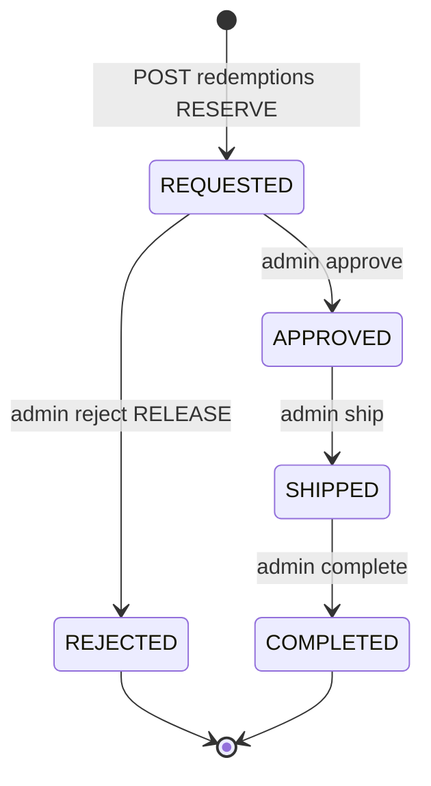

# 회원 리워드 시스템 코드 발췌 2차 — 교환·관리자·인덱스·부채

> **관련 문서**
> - [1차: 적립·정책·DB](./member-rewards-system-code-excerpts-1.md)
> - [API 엔드포인트 요약](../src/app/api/docs/points-rewards-api.md)

---

## 목차

1. [교환(리워드) RESERVE 모델 개요](#1-교환-reserve-모델-개요)
2. [교환 정책 검증](#2-교환-정책-검증)
3. [회원 교환 API·UI](#3-회원-교환-apiui)
4. [관리자 교환 워크플로 (현행 v2)](#4-관리자-교환-워크플로)
5. [카탈로그 API](#5-카탈로그-api)
6. [전체 파일·API 인덱스](#6-전체-파일api-인덱스)
7. [기술 부채·주의사항](#7-기술-부채주의사항)

---

## 1. 교환 RESERVE 모델 개요

### 동작 요약

| 단계 | DB 변경 | 포인트 |
|------|---------|--------|
| **신청 (POST)** | `reward_redemptions` REQUESTED + `point_ledger` RESERVE | `point_balance` **즉시 차감** |
| **승인** | status → APPROVED, 재고(stock) -1 | 추가 차감 없음 (이미 RESERVE 시 차감됨) |
| **반려** | status → REJECTED + `point_ledger` RELEASE | `point_balance` **복구** |
| **발송** | status → SHIPPED, tracking 저장 | 변동 없음 |
| **완료** | status → COMPLETED | 변동 없음 |

> v2 모델에서는 신청 시점에 포인트가 잔액에서 빠지므로, 승인 API는 재고만 처리합니다.

### 상태 전이



---

## 2. 교환 정책 검증

==================================================
파일 경로:
`src/lib/rewardPolicyValidation.ts`
==================================================

[1] 전체 — 교환 신청 직전 검증

```ts
/**
 * 리워드(경품 교환) 정책 검증
 * 검증 위치: POST /api/me/rewards/redemptions 호출 시 (교환 신청 직전)
 */
import type { SupabaseClient } from "@supabase/supabase-js";
import { getRewardPolicy } from "@/config/rewardPolicy";

export type ValidateRedemptionResult =
  | { ok: true }
  | { ok: false; message: string };

export async function validateRedemptionPolicy(
  userId: string,
  pointCost: number,
  supabase: SupabaseClient,
): Promise<ValidateRedemptionResult> {
  const policy = getRewardPolicy();

  if (pointCost < policy.minRedeemPoint) {
    return { ok: false, message: `교환 가능한 최소 포인트는 ${policy.minRedeemPoint.toLocaleString()}P입니다.` };
  }

  const startOfMonth = new Date(now.getFullYear(), now.getMonth(), 1).toISOString();
  const { count: monthlyCount } = await supabase
    .from("reward_redemptions")
    .select("id", { count: "exact", head: true })
    .eq("user_id", userId)
    .in("status", ["REQUESTED", "APPROVED", "SHIPPED", "COMPLETED"])
    .gte("created_at", startOfMonth);

  if ((monthlyCount ?? 0) >= policy.monthlyRedeemLimit) {
    return { ok: false, message: `이번 달 교환 신청 한도(${policy.monthlyRedeemLimit}회)를 모두 사용하셨습니다.` };
  }

  // rate limit: REQUESTED 건수 (윈도우 내)
  // reject threshold: REJECTED|CANCELED 누적 (lookback 일)

  return { ok: true };
}
```

---

## 3. 회원 교환 API·UI

### 3-1. 교환 신청 POST — RESERVE + balance 차감

==================================================
파일 경로:
`src/app/api/me/rewards/redemptions/route.ts`
==================================================

[1] POST 핵심 구간

```ts
/** 회원: 리워드 교환 신청 (REQUESTED + RESERVE + balance 예약 차감) */
export async function POST(request: Request) {
  const auth = await requireMemberSession();
  const userId = auth.session.memberId;

  // catalog 조회, is_active, stock > 0
  // balance >= point_cost (CONFIRMED만 — pending 미포함)
  // 진행 중 REQUESTED 1건 제한
  const policy = await validateRedemptionPolicy(userId, pointCost, supabase);
  if (!policy.ok) return NextResponse.json({ message: policy.message }, { status: 400 });

  const { data: redemption } = await supabase.from("reward_redemptions").insert({
    user_id: userId, catalog_id: catalog.id, status: "REQUESTED",
    point_amount: pointCost, shipping_name, shipping_phone, /* ... */
  }).select("id").maybeSingle();

  const redemptionId = redemption.id;

  // 1) RESERVE 원장
  await supabase.from("point_ledger").insert({
    user_id: userId, type: "RESERVE", status: "CONFIRMED", amount: pointCost,
    reason: "리워드 교환 신청", ref_type: "REWARD_REDEMPTION", ref_id: redemptionId,
  });

  // 2) balance 즉시 차감 (실패 시 redemption delete)
  await supabase.from("members").update({ point_balance: balance - pointCost }).eq("id", userId);

  await supabase.from("notifications").insert({
    user_id: userId, type: "REWARD_STATUS",
    title: "리워드 교환 신청 접수", body: "승인 후 발송이 진행됩니다.",
  });

  return NextResponse.json({ id: redemptionId, message: "..." }, { status: 201 });
}
```

### 3-2. 마이페이지 교환 UI

==================================================
파일 경로:
`src/components/mypage/RewardsRedemptionClient.tsx`
==================================================

[1] `requestRedemption` — POST `/api/me/rewards/redemptions`

```tsx
const requestRedemption = async () => {
  const res = await fetch("/api/me/rewards/redemptions", {
    method: "POST",
    headers: { "Content-Type": "application/json" },
    body: JSON.stringify({
      catalogId: selected.id,
      shippingName: form.shippingName,
      shippingPhone: form.shippingPhone,
      shippingZip: form.shippingZip || undefined,
      shippingAddress1: form.shippingAddress1,
      shippingAddress2: form.shippingAddress2 || undefined,
      contactTime: form.contactTime || undefined,
      userMessage: form.userMessage || undefined,
    }),
  });
  // 성공 시 refreshPoints() → GET /api/me/points
};
```

==================================================
파일 경로:
`src/app/mypage/rewards/page.tsx`
==================================================

[2] SSR — `getActiveRewardCatalog()` + `getMemberPointsData()` → `RewardsRedemptionClient`

==================================================
파일 경로:
`src/app/mypage/points/page.tsx`
==================================================

[3] SSR — 잔액·원장 내역, `/mypage/points/request` 적립 요청 링크

---

## 4. 관리자 교환 워크플로

> 현행 UI(`AdminRewardsManager`)는 **`/api/admin/rewards/redemptions/*`** (v2)만 사용합니다.

### 4-1. 승인 — 재고만 감소

==================================================
파일 경로:
`src/app/api/admin/rewards/redemptions/[id]/approve/route.ts`
==================================================

[1] status=REQUESTED → APPROVED, stock -1 (포인트 추가 차감 없음)

```ts
/** 관리자: 승인 — 재고 감소(stock not null 시), status=APPROVED, 알림 */
export async function POST(request: Request, context: { params: Promise<{ id: string }> }) {
  // status === REQUESTED 확인
  if (catalog.stock != null && catalog.stock <= 0) return 400;

  await supabaseAdmin.from("reward_catalog")
    .update({ stock: current - 1 }).eq("id", catalogId);

  await supabaseAdmin.from("reward_redemptions").update({
    status: "APPROVED", decided_at: now, admin_memo,
  }).eq("id", id);

  // notifications REWARD_STATUS "교환 승인"
}
```

### 4-2. 반려 — RELEASE + balance 복구

==================================================
파일 경로:
`src/app/api/admin/rewards/redemptions/[id]/reject/route.ts`
==================================================

[1] RELEASE ledger + point_balance += amount

```ts
/** 관리자: 반려 — RELEASE ledger + balance 복구, status=REJECTED */
export async function POST(/* ... */) {
  await supabaseAdmin.from("point_ledger").insert({
    user_id: userId, type: "RELEASE", status: "CONFIRMED", amount,
    reason: "경품 교환 반려로 인한 포인트 복구",
    ref_type: "REWARD_REDEMPTION", ref_id: id,
  });

  await supabaseAdmin.from("members")
    .update({ point_balance: currentBalance + amount }).eq("id", userId);

  await supabaseAdmin.from("reward_redemptions")
    .update({ status: "REJECTED", decided_at: now }).eq("id", id);
}
```

### 4-3. 발송 / 완료

==================================================
파일 경로:
`src/app/api/admin/rewards/redemptions/[id]/ship/route.ts`
==================================================

[1] tracking 저장, status=SHIPPED (APPROVED 또는 REQUESTED에서도 허용)

==================================================
파일 경로:
`src/app/api/admin/rewards/redemptions/[id]/complete/route.ts`
==================================================

[2] status=COMPLETED (SHIPPED 또는 APPROVED에서 허용)

### 4-4. 관리자 UI

==================================================
파일 경로:
`src/components/admin/AdminRewardsManager.tsx`
==================================================

[1] `runAction` — v2 API 일괄 호출

```tsx
const runAction = useCallback(
  async (action: "approve" | "reject" | "ship" | "complete", id: string, body?: Record<string, unknown>) => {
    const res = await fetch(`/api/admin/rewards/redemptions/${id}/${action}`, {
      method: "POST",
      headers: { "Content-Type": "application/json" },
      body: JSON.stringify(body ?? {}),
    });
    await fetchList(); // GET /api/admin/rewards/redemptions?status=...
  },
  [status, fetchList],
);
```

---

## 5. 카탈로그 API

==================================================
파일 경로:
`src/app/api/rewards/catalog/route.ts`
==================================================

[1] 공개 GET — `is_active=true`, `sort_order` 순, `point_cost` 반환

```ts
export async function GET() {
  const { data } = await supabase
    .from("reward_catalog")
    .select("id, title, description, point_cost, stock, image_url, is_active, sort_order, created_at")
    .eq("is_active", true)
    .order("sort_order", { ascending: true });
  return NextResponse.json(data ?? []);
}
```

==================================================
파일 경로:
`src/app/api/admin/reward-catalog/route.ts`
==================================================

[2] 관리자 GET(전체) / POST(등록) — `point_price` 기준 insert (v2 교환은 `point_cost` 사용)

---

## 6. 전체 파일·API 인덱스

### 회원 API

| 경로 | 메서드 | 설명 |
|------|--------|------|
| `/api/me/points` | GET | 잔액·pending·원장·소멸예정 |
| `/api/me/rewards/redemptions` | GET/POST | 교환 내역 / 신청(RESERVE) |
| `/api/points/earn-requests` | GET/POST | 적립 요청 목록 / 접수 |
| `/api/rewards/catalog` | GET | 활성 경품 목록 |

### 관리자 API — 포인트

| 경로 | 메서드 | 설명 |
|------|--------|------|
| `/api/admin/points/grant` | POST | 수동 지급 |
| `/api/admin/points/confirm` | POST | PENDING EARN 확정 |
| `/api/admin/points/earn-requests` | GET | 적립 요청 목록 |
| `/api/admin/points/earn-requests/[id]/approve` | POST | 적립 승인 |
| `/api/admin/points/earn-requests/[id]/reject` | POST | 적립 반려 |
| `/api/admin/points/earn-requests/csv-preview` | POST | CSV 미리보기 |
| `/api/admin/points/earn-requests/csv-apply` | POST | CSV 일괄 승인 |

### 관리자 API — 교환 (v2, 현행)

| 경로 | 메서드 | 설명 |
|------|--------|------|
| `/api/admin/rewards/redemptions` | GET | 교환 목록 |
| `/api/admin/rewards/redemptions/[id]/approve` | POST | 승인(재고만) |
| `/api/admin/rewards/redemptions/[id]/reject` | POST | 반려(RELEASE) |
| `/api/admin/rewards/redemptions/[id]/ship` | POST | 발송 |
| `/api/admin/rewards/redemptions/[id]/complete` | POST | 완료 |

### 관리자 API — 교환 (레거시, 사용 금지)

| 경로 | 메서드 | 설명 |
|------|--------|------|
| `/api/admin/reward-redemptions` | GET | 레거시 목록 |
| `/api/admin/reward-redemptions/[id]/approve` | POST | **승인 시 USE 재차감** — v2 RESERVE와 충돌 |
| `/api/admin/reward-redemptions/[id]/reject` | POST | 레거시 반려 |

### 서비스·라이브러리

| 경로 | 역할 |
|------|------|
| `src/server/services/points/grantPoints.ts` | EARN 지급 핵심 |
| `src/server/services/points/earnRequests.ts` | 증빙 검증·CSV |
| `src/config/rewardPolicy.ts` | env 정책 |
| `src/lib/rewardPolicyValidation.ts` | 교환 정책 검증 |
| `src/lib/member/meServerData.ts` | 마이페이지 SSR 데이터 |
| `src/lib/reviewRewards.ts` | 리뷰 보상 (원장 미연동) |
| `src/types/pointsRewardsV2.ts` | v2 타입 |

### UI

| 경로 | 역할 |
|------|------|
| `src/app/mypage/points/page.tsx` | 포인트 잔액·내역 |
| `src/app/mypage/rewards/page.tsx` | 리워드 교환소 |
| `src/components/points/EarnRequestForm.tsx` | 적립 요청 폼 |
| `src/components/mypage/RewardsRedemptionClient.tsx` | 교환 클라이언트 |
| `src/components/admin/AdminPointsGrantManager.tsx` | 관리자 지급 |
| `src/components/admin/AdminRewardsManager.tsx` | 관리자 교환 처리 |

### 마이그레이션

| 경로 | 내용 |
|------|------|
| `supabase/migrations/20250304000000_points_rewards_v2.sql` | v2 스키마 |
| `supabase/migrations/20260304070000_point_earn_requests_step3.sql` | 적립 요청 |

### 레거시 API (중복·드롭 테이블 참조)

| 경로 | 문제 |
|------|------|
| `/api/members/me/points` | `pending_points` 테이블 참조 (v2에서 drop) |
| `/api/members/me/rewards/redemptions` | `/api/me/rewards/redemptions`와 중복 |
| `/api/rewards/redemptions` | 구 경로 |

---

## 7. 기술 부채·주의사항

### 7-1. 레거시 `/api/admin/reward-redemptions/*` — 이중 차감 위험

v2 신청 시 이미 `RESERVE` + `balance` 차감이 완료됩니다. 레거시 approve는 **승인 시점에 USE + balance 재차감**합니다.

```ts
// src/app/api/admin/reward-redemptions/[id]/approve/route.ts (발췌)
await supabaseAdmin.from("point_ledger").insert({
  type: "USE", status: "CONFIRMED", amount: pointAmount, reason: "경품 교환",
});
await supabaseAdmin.from("members").update({ point_balance: newBalance }); // 재차감
```

**조치:** `AdminRewardsManager`는 v2 경로만 사용. 레거시 라우트 삭제 또는 410 응답 권장.

### 7-2. `review_rewards` — point_ledger 미연동

`createReviewReward()`는 `review_rewards` 테이블에만 insert하며 `grantPointsToUser`를 호출하지 않습니다.

```ts
// src/lib/reviewRewards.ts (발췌)
await supabase.from("review_rewards").insert({
  review_id: review.id, member_id: memberId, reward_type: REWARD_TYPE_REVIEW_WRITE, points,
});
// members.point_balance / point_ledger 갱신 없음
```

### 7-3. `EXPIRE` / `ADJUST` — 타입만 존재

DB check constraint와 TypeScript union에 포함되나, 소멸 배치·조정 API·UI가 없습니다. `expires_at`은 EARN 생성 시 설정되지만 자동 소멸 로직 없음.

### 7-4. `/api/members/me/points` — drop된 `pending_points` 참조

v2 마이그레이션에서 `pending_points` 테이블을 drop했으나 레거시 API가 여전히 조회합니다.

```ts
// src/app/api/members/me/points/route.ts (발췌)
supabase.from("pending_points").select("*").eq("member_id", memberId)
```

현행 마이페이지는 `/api/me/points` 및 `getMemberPointsData()` (`point_pending` 컬럼) 사용.

### 7-5. `point_price` vs `point_cost` 이중화

- DB: `reward_catalog.point_price`(NOT NULL) + `point_cost`(마이그레이션 시 point_price 복사)
- 관리자 등록 API: `point_price`만 insert
- 교환 API: `point_cost`만 사용

관리자 UI에서 `point_cost` 미설정 시 교환 불가(0P) 가능 — 등록 시 두 컬럼 동기화 필요.

### 7-6. `/api/admin/points/confirm` — UI 없음

PENDING EARN → CONFIRMED 전환 API는 구현되어 있으나 관리자 화면에서 호출하는 UI가 없습니다. Earn Request의 `grant_status=PENDING` 지급 후 수동 확정은 API 직접 호출만 가능.

### 7-7. DB 트랜잭션 / RPC 미사용

교환 신청·반려·지급 등 다단계 write(ledger + members + redemptions)가 **순차 supabase 호출**로 처리됩니다. 중간 실패 시 부분 롤백(delete)은 일부 경로에만 있으며, DB 레벨 원자성은 보장되지 않습니다.

**개선 방향:** Postgres RPC(`BEGIN … COMMIT`) 또는 Supabase Edge Function으로 ledger+balance+redemption을 단일 트랜잭션화.

### 7-8. RESERVE 잔액 표시

`point_balance`는 RESERVE 시 즉시 차감되므로 UI상 "사용 가능" 금액은 정확합니다. 다만 원장에 RESERVE/RELEASE가 쌍으로 남아 감사(audit) 시 승인·완료 단계와의 연결은 `ref_id=redemptionId`로 추적합니다. 승인·완료 시 별도 USE 원장은 생성하지 않습니다.
