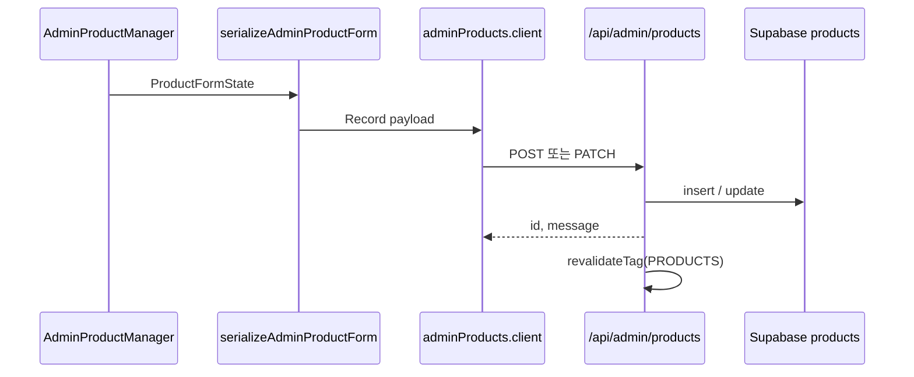

# 상품 등록 백엔드 참조 문서

관리자 콘솔에서 상품을 **생성·수정**할 때 사용하는 API, Supabase 쿼리, TypeScript 타입, DB 스키마를 정리한 문서입니다.

> **최종 갱신 기준:** `main` 브랜치 (2026-06)

---

## 1. 아키텍처 요약

상품 **쓰기(insert/update)** 는 별도 `service` 레이어가 아니라 **Next.js API Route**에서 `supabaseAdmin`(service_role)으로 직접 수행합니다.



| 단계 | 파일 | 역할 |
|------|------|------|
| UI | [`src/components/admin/products/AdminProductManager.tsx`](../src/components/admin/products/AdminProductManager.tsx) | 폼 제출, 목록·편집 화면 |
| 직렬화 | [`src/components/admin/products/editor/adminProductForm.serializer.ts`](../src/components/admin/products/editor/adminProductForm.serializer.ts) | `ProductFormState` → API body |
| 역직렬화 | [`src/components/admin/products/editor/adminProductForm.deserializer.ts`](../src/components/admin/products/editor/adminProductForm.deserializer.ts) | `Product` → `ProductFormState` (편집 로드) |
| 클라이언트 | [`src/components/admin/products/api/adminProducts.client.ts`](../src/components/admin/products/api/adminProducts.client.ts) | `fetch` 래퍼 |
| API | [`src/app/api/admin/products/route.ts`](../src/app/api/admin/products/route.ts), [`[id]/route.ts`](../src/app/api/admin/products/[id]/route.ts) | 인증·검증·DB 쓰기 |
| 읽기 정규화 | [`src/lib/products.ts`](../src/lib/products.ts) | `normalizeProduct()`, 공개/관리자 조회 |
| Import 경로 | [`src/lib/admin/buildProductPayload.ts`](../src/lib/admin/buildProductPayload.ts) | 모두투어·하나투어 import → 동일 POST API |

**인증:** 모든 관리자 상품 API는 [`requireAdminSession()`](../src/lib/apiAuth.ts)으로 쿠키 기반 관리자 세션을 검증합니다.

**RLS:** `products` 테이블의 anon write 정책은 제거되었습니다([`20260623110000_security_warnings_phase2_admin_rls.sql`](../supabase/migrations/20260623110000_security_warnings_phase2_admin_rls.sql)). 서버는 `supabaseAdmin`만 INSERT/UPDATE/DELETE 합니다.

---

## 2. API Route

### 2.1 핵심 CRUD

| 메서드 | 경로 | 파일 | 설명 |
|--------|------|------|------|
| `GET` | `/api/admin/products` | [`route.ts`](../src/app/api/admin/products/route.ts) | 목록 (페이지네이션·정렬·필터) |
| `POST` | `/api/admin/products` | [`route.ts`](../src/app/api/admin/products/route.ts) | **상품 생성** |
| `GET` | `/api/admin/products/[id]` | [`[id]/route.ts`](../src/app/api/admin/products/[id]/route.ts) | 단건 조회 (`select *`) |
| `PATCH` | `/api/admin/products/[id]` | [`[id]/route.ts`](../src/app/api/admin/products/[id]/route.ts) | **상품 수정** (부분 업데이트) |
| `DELETE` | `/api/admin/products/[id]` | [`[id]/route.ts`](../src/app/api/admin/products/[id]/route.ts) | 상품 삭제 |

#### GET 목록 쿼리 파라미터

| 파라미터 | 설명 |
|----------|------|
| `page`, `pageSize` | 페이지네이션 |
| `sortField` | `title`, `category`, `price`, `sort_order`, `created_at`, `updated_at` (`updated_at` 없으면 `created_at` 사용) |
| `sortDirection` | `asc` / `desc` |
| `q` | 제목·설명·category·theme·`product_source_url` ILIKE 검색 |
| `is_active` | `true` / `false` |
| `status` | `AVAILABLE`, `LIMITED`, `SOLD_OUT`, `CONSULT_REQUIRED` |
| `destination_id`, `product_line_id` | taxonomy FK 필터 |
| `theme_q` | `theme` ILIKE |

#### POST 생성 — 필수·검증

- **필수:** `title`, `description`, `image_url` (또는 `images_json[0]`)
- **`product_source_url` 중복:** 동일 URL 상품 존재 시 `409` + `existingId`
- **저장 후:** `revalidateTag(CACHE_TAGS.PRODUCTS)`, `revalidatePath("/products")`
- **`images_json` 컬럼 없는 DB:** fallback insert 후 `warningCode: "IMAGES_JSON_NOT_PERSISTED"`

#### POST/PATCH 공통 유틸

- `toSafeInteger()` — PostgreSQL `integer` 범위 보정
- `seasonalPriceBandsToJsonColumn()` — 구간가 jsonb 변환 ([`seasonalPriceBands.ts`](../src/lib/products/seasonalPriceBands.ts))
- 요청 body 타입: 라우트 파일 내 `ProductBody` (~100개 optional 필드)

#### API body → DB 컬럼 매핑 (주요)

| API body 필드 | DB 컬럼 | 비고 |
|---------------|---------|------|
| `title`, `description`, `image_url` | 동일 | 필수(생성) |
| `images_json` | `images_json` | `jsonb` URL 배열 |
| `category`, `theme` | 동일 | `category` 기본값 `여행상품` |
| `destination_id`, `product_line_id` | 동일 | FK → `product_taxonomies` |
| `campaigns` | `campaigns_json` | 이름 배열 |
| `tags` | `tags_json` | 이름 배열 |
| `price` | `price` | integer |
| `seasonal_price_bands` | `seasonal_price_bands` | jsonb `{ offSeason, weekend, peakSeason }` |
| `itinerary_v2_json` | `itinerary_v2_json` | jsonb, `days` 배열 필수 |
| `itinerary_days_json` | `itinerary_days_json` | jsonb (STEP 0 구조) |
| `itinerary_media_json` | `itinerary_media_json` | jsonb |
| `theme_chart_json` | `theme_chart_json` | jsonb `{ items: [{ label, percent }] }`, 2개 이상 |
| `overview_accommodation` 등 | 동일 | `overview_json`은 **저장하지 않음** (상세에서 파생) |
| `options` | `options` | jsonb (`ProductOptions`) |
| `status` | `status` | enum 문자열 |
| `departure_*`, `arrival_*` | 동일 | 항공편 14컬럼 |
| `booking_notes`, `travel_notes`, `booking_conditions`, `refund_policy` | 동일 | 약관·유의 |
| `*_template_type` | 동일 | 템플릿 키 |

전체 필드 목록은 [`route.ts`의 `ProductBody`](../src/app/api/admin/products/route.ts) 및 [`[id]/route.ts`](../src/app/api/admin/products/[id]/route.ts) 참고.

### 2.2 보조 API (DB 쓰기 없음 또는 별도 테이블)

| 메서드 | 경로 | 설명 |
|--------|------|------|
| `POST` | `/api/admin/products/preview` | 폼 기반 미리보기 ([`productPreview.ts`](../src/lib/admin/productPreview.ts)) |
| `GET` | `/api/admin/products/[id]/kakao-post` | 카카오 채널 게시글 텍스트 |
| `GET` | `/api/admin/products/[id]/blog-post` | 블로그 포스트 텍스트 |
| `GET` | `/api/admin/products/[id]/band-hook` | 밴드 훅 문구 |
| `GET` | `/api/admin/products/[id]/smartstore-html` | 스마트스토어 HTML |
| `POST` | `/api/admin/products/[id]/review-summary` | AI 리뷰 요약 (`product_review_summaries` upsert) |

### 2.3 이미지 업로드 (상품 등록 전처리)

| 메서드 | 경로 | 설명 |
|--------|------|------|
| `POST` | `/api/admin/uploads/image` | 단일 이미지 업로드 |
| `POST` | `/api/admin/uploads/images` | 다중 업로드 |

클라이언트: [`src/lib/admin/uploadProductImages.ts`](../src/lib/admin/uploadProductImages.ts)

### 2.4 Import 전용 API

| 메서드 | 경로 | 설명 |
|--------|------|------|
| `POST` | `/api/admin/modetour/normalize-import-images` | 모두투어 import 이미지 정규화 |
| `POST` | `/api/admin/hanatour/normalize-import-images` | 하나투어 import 이미지 정규화 |
| `POST` | `/api/admin/products/import-band` | 밴드/HWP 텍스트 AI 파싱 후 상품 insert |

Import UI는 `buildProductCreateBody()`로 payload를 만든 뒤 `createAdminProduct()` → `POST /api/admin/products`를 호출합니다.

---

## 3. 클라이언트·직렬화 계층

### 3.1 Fetch 클라이언트

파일: [`src/components/admin/products/api/adminProducts.client.ts`](../src/components/admin/products/api/adminProducts.client.ts)

| 함수 | HTTP | 설명 |
|------|------|------|
| `fetchAdminProducts(params)` | `GET /api/admin/products` | 목록 |
| `fetchAdminProduct(id)` | `GET /api/admin/products/:id` | 단건 |
| `createAdminProduct(payload)` | `POST /api/admin/products` | 생성 |
| `updateAdminProduct(id, payload)` | `PATCH /api/admin/products/:id` | 전체 수정 |
| `patchAdminProduct(id, patch)` | `PATCH` | 부분 수정 |
| `deleteAdminProduct(id)` | `DELETE` | 삭제 |

타입: [`adminProducts.types.ts`](../src/components/admin/products/api/adminProducts.types.ts)

### 3.2 폼 ↔ API 변환

| 파일 | 함수 | 설명 |
|------|------|------|
| [`adminProductForm.serializer.ts`](../src/components/admin/products/editor/adminProductForm.serializer.ts) | `serializeAdminProductForm()` | 폼 → API body |
| [`adminProductForm.deserializer.ts`](../src/components/admin/products/editor/adminProductForm.deserializer.ts) | `deserializeAdminProductToForm()` | DB row → 폼 |
| [`adminProductForm.derive.ts`](../src/components/admin/products/editor/adminProductForm.derive.ts) | `deriveDerivedFieldsForSave()` | 저장 시 파생 필드 |
| [`buildProductPayload.ts`](../src/lib/admin/buildProductPayload.ts) | `buildProductCreateBody()` | Import 페이지용 래퍼 |

### 3.3 Supabase 직접 쓰기 (API Route 내부)

```typescript
// 생성
await supabaseAdmin.from("products").insert(insertPayload).select("id").maybeSingle();

// 수정
await supabaseAdmin.from("products").update(updates).eq("id", id).select("id").maybeSingle();

// 삭제
await supabaseAdmin.from("products").delete().eq("id", id);
```

`src/lib`에는 `products` 테이블 전용 insert/update 서비스 함수는 **없습니다**. 읽기·정규화는 [`src/lib/products.ts`](../src/lib/products.ts)의 `getProducts()`, `getProductById()`, `normalizeProduct()` 등이 담당합니다.

---

## 4. 데이터베이스 스키마

### 4.1 테이블 개요

- **테이블:** `public.products`
- **PK:** `id` (`uuid`, `gen_random_uuid()`)
- **FK:** `destination_id`, `product_line_id` → `public.product_taxonomies(id)` ON DELETE SET NULL

### 4.2 컬럼 목록 (baseline + migrations 합산)

#### 기본 (baseline)

| 컬럼 | 타입 | NULL | 기본값 | 설명 |
|------|------|------|--------|------|
| `id` | `uuid` | NO | `gen_random_uuid()` | PK |
| `title` | `text` | NO | — | 상품명 |
| `description` | `text` | NO | — | 상세 설명 |
| `image_url` | `text` | NO | — | 대표 이미지 URL |
| `category` | `text` | NO | `'여행상품'` | 레거시 분류 문자열 |
| `price` | `integer` | YES | — | 기준가 (원) |
| `duration` | `text` | YES | — | 여행 기간 |
| `itinerary` | `text` | YES | — | 일정 요약 |
| `inclusions` | `text` | YES | — | 포함 사항 |
| `is_active` | `boolean` | NO | `true` | 노출 여부 |
| `sort_order` | `integer` | YES | — | 정렬 순서 |
| `terms_template_type` | `text` | YES | — | 레거시 약관 템플릿 키 |
| `created_at` | `timestamptz` | NO | `now()` | 생성 시각 |

#### 핵심 확장 ([`20260308170000`](../supabase/migrations/20260308170000_normalize_products_core_columns.sql))

| 컬럼 | 타입 | 설명 |
|------|------|------|
| `theme` | `text` | 테마 토큰 문자열 |
| `images_json` | `jsonb` | 이미지 URL 배열 |
| `point_benefits`, `point_tourism`, `point_guide` | `text` | 포인트·관광·가이드 |
| `meeting_info`, `travel_insurance` | `text` | 미팅·보험 |
| `included_items`, `excluded_items` | `text` | 포함·불포함 |
| `detailed_schedule`, `optional_tours` | `text` | 상세 일정·선택관광 |
| `terms_and_notes` | `text` | 레거시 약관 통합 |
| `min_departure_people` | `integer` | 최소 출발 인원 |
| `product_source_url` | `text` | 원본 URL (모두투어·하나투어 등, 유니크 검사는 API) |

#### 항공·SEO·관리자·일정 jsonb ([`20260308180000`](../supabase/migrations/20260308180000_normalize_products_extended_columns.sql))

| 컬럼 | 타입 | 설명 |
|------|------|------|
| `departure_from_airport` ~ `departure_baggage_limit` | `text` | 출발편 7컬럼 |
| `arrival_from_airport` ~ `arrival_baggage_limit` | `text` | 도착편 7컬럼 |
| `meta_title`, `meta_description` | `text` | SEO |
| `status` | `text` | `AVAILABLE` \| `LIMITED` \| `SOLD_OUT` \| `CONSULT_REQUIRED` |
| `options` | `jsonb` | 상품 옵션 정의 |
| `fuel_included` | `boolean` | 유류할증료 포함 |
| `price_meta`, `meta_info`, `one_liner` | `text` | 카드·상세 메타 |
| `overview_json` | `jsonb` | 오버뷰 (레거시; 신규 저장은 개별 컬럼 우선) |
| `overview_accommodation`, `overview_region`, `overview_duration` | `text` | 오버뷰 카드 입력 |
| `overview_cover_url` | `text` | 오버뷰 커버 |
| `itinerary_days_json` | `jsonb` | 구조화 일정 STEP 0 |
| `itinerary_media_json` | `jsonb` | Day별 미디어 URL 맵 |
| `itinerary_v2_json` | `jsonb` | 구조화 일정 v2 |
| `theme_chart_json` | `jsonb` | 테마 구성비 차트 |

#### Taxonomy 축 ([`20260319000000`](../supabase/migrations/20260319000000_products_taxonomy_axes.sql))

| 컬럼 | 타입 | 설명 |
|------|------|------|
| `destination_id` | `uuid` | 지역 taxonomy FK |
| `product_line_id` | `uuid` | 상품군 taxonomy FK |
| `campaigns_json` | `jsonb` | 기획/캠페인 이름 배열 |
| `tags_json` | `jsonb` | 태그 이름 배열 |

#### 가격·약관 ([`20260407120000`](../supabase/migrations/20260407120000_products_seasonal_price_bands.sql) ~ [`20260411120000`](../supabase/migrations/20260411120000_add_refund_policy.sql))

| 컬럼 | 타입 | 설명 |
|------|------|------|
| `seasonal_price_bands` | `jsonb` | 비수기·주말·성수기 구간가 |
| `booking_notes`, `travel_notes`, `booking_conditions` | `text` | 그룹별 유의사항 |
| `booking_notes_template_type`, `travel_notes_template_type`, `booking_conditions_template_type` | `text` | 공지 템플릿 키 |
| `refund_policy`, `refund_policy_template_type` | `text` | 환불·취소 규정 |

### 4.3 인덱스 (주요)

| 인덱스 | 컬럼 |
|--------|------|
| `idx_products_sort_order` | `sort_order` |
| `idx_products_is_active` | `is_active` |
| `idx_products_created_at` | `created_at DESC` |
| `idx_products_category` | `category` |
| `idx_products_theme` | `theme` (partial) |
| `idx_products_destination_id` | `destination_id` |
| `idx_products_product_line_id` | `product_line_id` |

### 4.4 RLS

- **활성화:** `ENABLE ROW LEVEL SECURITY`
- **anon:** `SELECT`만 허용 (공개 상품 목록·상세)
- **쓰기:** `supabaseAdmin` (service_role) — [`20260623110000`](../supabase/migrations/20260623110000_security_warnings_phase2_admin_rls.sql)에서 anon insert/update/delete 제거

### 4.5 스키마 참조 파일

| 파일 | 용도 |
|------|------|
| [`supabase/schema/baseline.sql`](../supabase/schema/baseline.sql) | 초기 `products` 정의 (참고용) |
| [`supabase/migrations/20260308170000_*.sql`](../supabase/migrations/20260308170000_normalize_products_core_columns.sql) | 핵심 컬럼 |
| [`supabase/migrations/20260308180000_*.sql`](../supabase/migrations/20260308180000_normalize_products_extended_columns.sql) | 항공·SEO·jsonb |
| [`supabase/migrations/20260319000000_*.sql`](../supabase/migrations/20260319000000_products_taxonomy_axes.sql) | taxonomy FK |
| [`supabase/migrations/20260407120000_*.sql`](../supabase/migrations/20260407120000_products_seasonal_price_bands.sql) | 구간가 |
| [`supabase/migrations/20260408120000_*.sql`](../supabase/migrations/20260408120000_add_product_notice_fields.sql) | 유의사항 |
| [`supabase/migrations/20260409120000_*.sql`](../supabase/migrations/20260409120000_products_notice_template_types.sql) | 템플릿 타입 |
| [`supabase/migrations/20260411120000_*.sql`](../supabase/migrations/20260411120000_add_refund_policy.sql) | 환불 정책 |

---

## 5. TypeScript 타입

### 5.1 도메인 모델 — `Product`

파일: [`src/types/product.ts`](../src/types/product.ts)

앱 전역에서 사용하는 상품 타입. DB row를 `normalizeProduct()`가 이 형태로 정규화합니다.

주요 필드 그룹:

- **식별·기본:** `id`, `title`, `description`, `image_url`, `images_json`
- **분류:** `category`(deprecated), `theme`, `destination_id`, `product_line_id`, `campaigns`, `tags`
- **가격:** `price`, `seasonal_price_bands`, `price_meta`, `fuel_included`, `options`
- **여행 정보:** `duration`, `itinerary`, `inclusions`, `point_*`, `meeting_info`, …
- **항공:** `departure_*`, `arrival_*` (14필드)
- **약관:** `booking_notes`, `travel_notes`, `booking_conditions`, `refund_policy`, `*_template_type`
- **일정 jsonb:** `itinerary_days_json`, `itinerary_v2_json`, `itinerary_media_json`, `theme_chart_json`
- **오버뷰:** `overview_json`, `overview_accommodation`, `overview_region`, `overview_duration`
- **관리:** `is_active`, `sort_order`, `status`, `product_source_url`, `created_at`

관련 하위 타입: `SeasonalPriceBands`, `ProductOptions`, `ItineraryV2`, `ItineraryStructuredDay`, `ProductOverview`, `ProductTrust`

### 5.2 관리자 폼 — `ProductFormState`

파일: [`src/types/adminProductForm.ts`](../src/types/adminProductForm.ts)

UI 폼 전용. API와 차이:

- 가격·정렬은 **문자열** (`price`, `sort_order`)
- `point_tourism` 등은 **`"O" | "X"`**
- `seasonal_price_bands`는 `{ offSeason, weekend, peakSeason }` **문자열** 필드

헬퍼: `createEmptyProductFormState()`, `mergeProductFormWithSchemaDefaults()`

### 5.3 API·에디터 타입

| 파일 | 타입 | 설명 |
|------|------|------|
| [`adminProductForm.types.ts`](../src/components/admin/products/editor/adminProductForm.types.ts) | `AdminProductSavePayload`, `SectionId`, `FormIssue` | serializer 출력 |
| [`adminProducts.types.ts`](../src/components/admin/products/api/adminProducts.types.ts) | `FetchAdminProductsParams`, `AdminProductSaveResponse` | 클라이언트 응답 |
| [`route.ts`](../src/app/api/admin/products/route.ts) | `ProductBody` | API 요청 body (인라인) |
| [`productTaxonomy.ts`](../src/types/productTaxonomy.ts) | `ProductTaxonomy` | `destination_id` / `product_line_id` FK 대상 |
| [`hanatourImport.ts`](../src/types/hanatourImport.ts) | Import draft 타입 | 하나투어 확장 import |

---

## 6. 생성 플로우 예시

1. 관리자가 [`AdminProductManager`](../src/components/admin/products/AdminProductManager.tsx)에서 저장 클릭
2. `serializeAdminProductForm(form)` → `Record<string, unknown>`
3. `createAdminProduct(payload)` → `POST /api/admin/products`
4. API: 필수값 검증 → `product_source_url` 중복 검사 → `insertPayload` 구성
5. `supabaseAdmin.from("products").insert(...)` → `{ id }` 반환
6. `revalidateTag` / `revalidatePath` 후 목록 또는 편집 화면으로 이동

**모두투어·하나투어 import:** [`buildProductCreateBody()`](../src/lib/admin/buildProductPayload.ts) → 동일 `POST` 경로.

---

## 7. 관련 문서·파일 빠른 링크

| 항목 | 경로 |
|------|------|
| 상품 목록 정책 | [`src/lib/products/productsListingPolicy.ts`](../src/lib/products/productsListingPolicy.ts) |
| 구간가 유틸 | [`src/lib/products/seasonalPriceBands.ts`](../src/lib/products/seasonalPriceBands.ts) |
| 변경 diff (저장 전) | [`src/lib/adminProductDiff.ts`](../src/lib/adminProductDiff.ts) |
| 캐시 태그 | [`src/lib/cacheTags.ts`](../src/lib/cacheTags.ts) |
| Supabase Admin 클라이언트 | [`src/lib/supabaseAdmin.ts`](../src/lib/supabaseAdmin.ts) |
